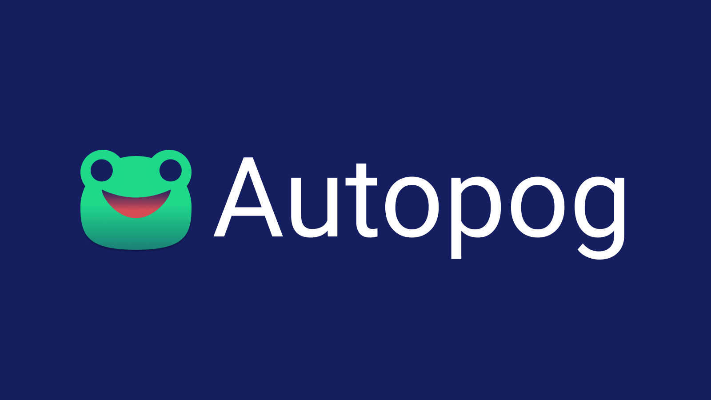

  

## 📝 Overview

Autopog is a browser-based web application that simulates a lively, fake Twitch chat and can listen to your mic for a more immersive experience. The result mimics the chat plugin from Streamlabs OBS and can be injected directly into your stream.

## 🙏 Credits 

This project builds on existing open source projects and would not have been made possible without their prior efforts:

- [gumman/twitch_chat_simulator](https://github.com/gummangummangumman/twitch_chat_simulator) for the initial Twitch-based UI and spam implementation.
- [AsaeoluElijah/say-it](https://github.com/AsaoluElijah/say-it) (MIT) for its speech-to-text implementation.
- [cwilso/volume-meter](https://github.com/cwilso/volume-meter) (MIT) for its audio input meter implementation.

Miscellaneous credits:

- [checkly/headless-recorder](https://github.com/checkly/headless-recorder) for this README's formatting.
